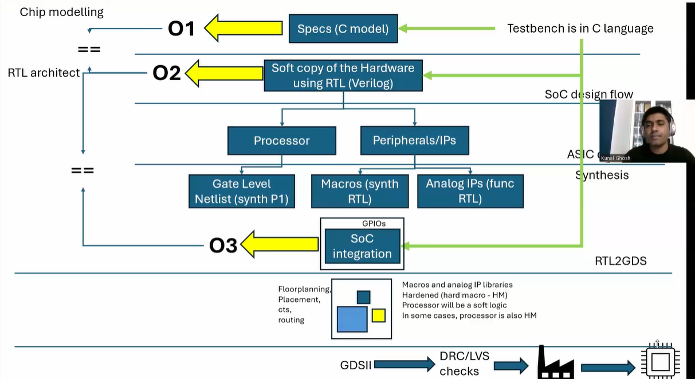
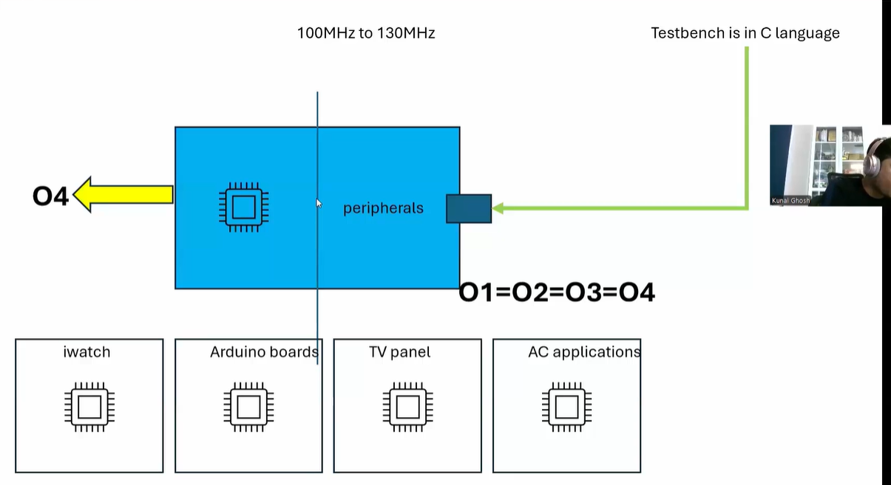

# Week 0 – Task 1  
**Digital VLSI SoC Design & Planning (RISC-V Tapeout Program – India)**  

---

## 📌 SoC Design Flow (O1 → O4)

### 🔹 O1 – Chip Modelling
- Define specs using **C model**  
- Verify functionality with **C testbench**  

---

### 🔹 O2 – RTL Architecture
- Hardware description in **RTL (Verilog)**  
- Functional verification: **C model ≡ RTL model** (same testbench)  

---

### 🔹 O3 – Synthesis & SoC Integration
- **Processor** → Gate-level netlist  
- **Peripherals/IPs** → Synthesized macros & analog IPs  
- Integrated via **GPIOs**  
- Validation: RTL design ↔ Gate-level design  

---

### 🔹 O4 – RTL → GDSII
- **PnR Flow** → Floorplanning, Placement, CTS, Routing  
- Macros & analog IPs hardened (**Hard Macros**)  
- Processor can be **soft logic** or **hard macro**  
- Output: **GDSII** → checked with **DRC/LVS** before tapeout  
- Final validation: **O1 = O2 = O3 = O4**  

---

## 📷 Flow Diagrams

  
   
  <em>Figure 1: SoC Design Flow (O1 → O4)</em>

  
   
  <em>Figure 2: O4 Stage and Real-world Applications</em>

---

## ✅ Applications
Once taped out & verified, the SoC is deployed in:  
- Smart wearables (iWatch)  
- Arduino boards  
- TV panels  
- AC / consumer electronics  

---
