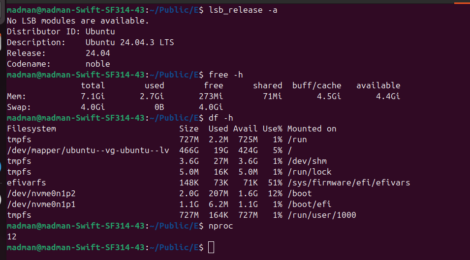

# Week 0 – Task 2  
**System Check & Basic Tool Installation (RISC-V Tapeout Program – India)**  

---

## 🖥️ System Check  
System requirements for the program environment:  

- **OS**: Ubuntu 20.04+  
- **RAM**: 6 GB  
- **Storage**: 50 GB  
- **CPU**: 4 vCPUs  

📷 *Snapshot Placeholder*  
  

---

## ⚙️ Tool Checks  

### 🔹 Yosys – Logic Synthesis  
Used for **RTL synthesis** in the digital design flow.  

````bash
$ sudo apt-get update
$ git clone https://github.com/YosysHQ/yosys.git
$ cd yosys
$ sudo apt install make build-essential clang bison flex \
    libreadline-dev gawk tcl-dev libffi-dev git \
    graphviz xdot pkg-config python3 libboost-system-dev \
    libboost-python-dev libboost-filesystem-dev zlib1g-dev
$ make config-gcc
$ make
$ sudo make install
````
### 🔹 Icarus Verilog (iverilog) - Simulation
Used for **Verilog simulation and testing.**


$ sudo apt-get update
$ sudo apt-get install iverilog 

### 🔹 GTKWave – Waveform Viewer
Used to **visualize simulation waveforms.**


$ sudo apt-get update
$ sudo apt install gtkwave 

