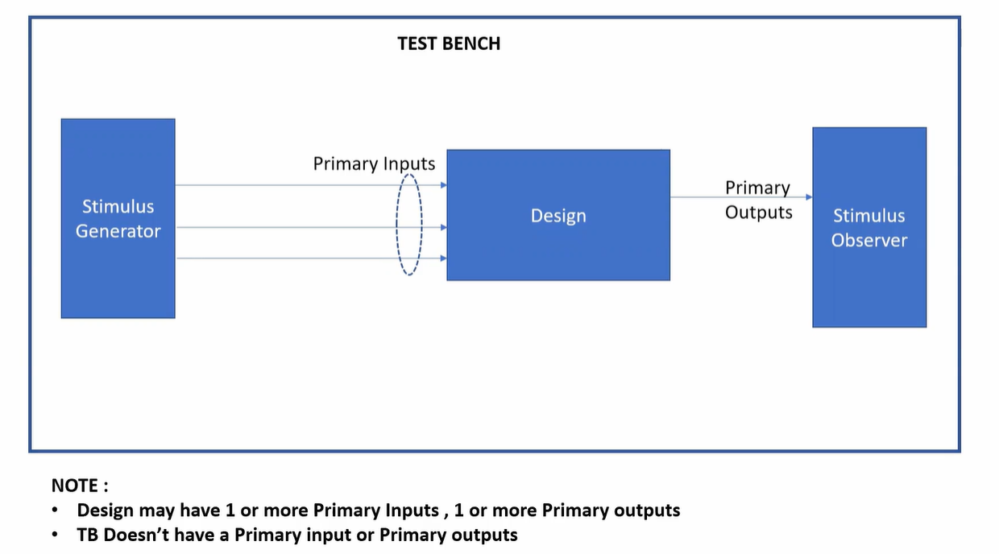
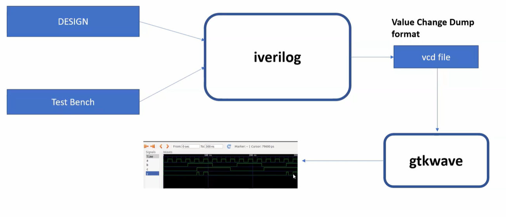

# 🔹 Day 1 – Skill 1: Introduction to Icarus Verilog (iverilog)

---

## Lessons

## L1 – Introduction to iverilog Design Testbench

### Simulator
- RTL design is checked for adherence to the spec by simulating the design.
- Simulator is the tool used for simulating the design.
    - Iverilog is the tool used for this course.

### Design
- Design is the actual Verilog code or set of verilog Codes which has the intended functionality to meet the required specifications.

### Testbench
- testbench is the setup to supply stimulus (test_vectors) to the design to check its functionality.

### How Simulator works
- Simulator looks for the changes on the input signals.
- Upon change to the input, the output is evaluated.
  - If no change in the input, no change in the output.
- Simulator is looking for the change in the values of input.

  
   
  <em>Figure 1: Basic Testbench Structure</em>

---

### Iverilog based Simulation Flow

  
   
  <em>Figure 2: Iverilog based Simulation Flow</em>

----

