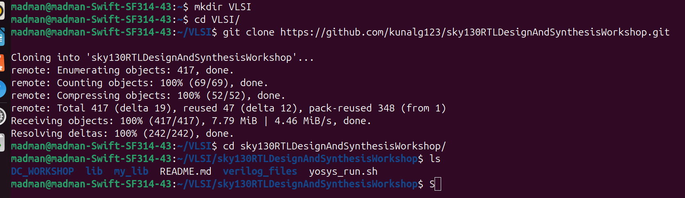
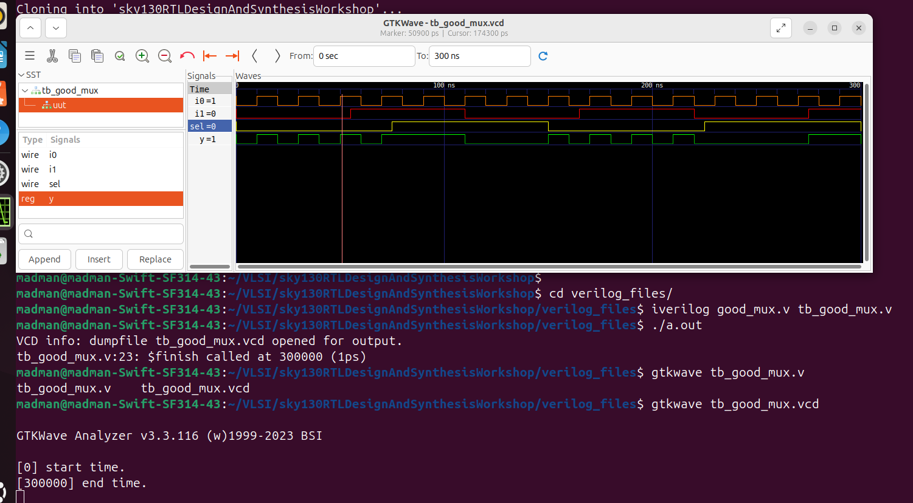

# 🔹 Day 1 – Skill 2: Labs using Icarus Verilog and GTKWave

---

## Lessons

## L1 – Lab1: Introduction to Lab

- File setup and cloning required git repos to begin with.

````bash
mkdir VLSI
cd VLSI
git clone https://github.com/kunalg123/vsdflow.git
git clone https://github.com/kunalg123/sky130RTLDesignAndSynthesisWorkshop.git
````

<p align="center">
  
  <br/>
  <em>Figure 1: VLSI directory with cloned repos</em>
</p>

---

## L2 – Lab2: Introduction to Icarus Verilog & GTKWave (Part 1)

- We will start this lab with simulating a basic design of a mux present in the directory cloned.
- We will start with being present in VLSI directory created in Lab 1.

**Step 1: Enter the Folder of Verilog Files**

````bash
cd sky130RTLDesignAndSynthesisWorkshop
cd verilog_files
````

**Step 2: Usingn Iverilog build the vcd file for good mux**

````bash
iverilog good_mux.v tb_good_mux.v
./a.out
````
- This will create `tb_good_mux.vcd` file.

**Step 3: Observe the functionality using waveforms**
- For this we need to use gtkwave

````bash
gtkwave tb_good_mux.vcd
````

<p align="center">
  
  <br/>
  <em>Figure 2: Good Mux Waveform in GTKWavew</em>
</p>

---

## L3 – Lab2: Introduction to Icarus Verilog & GTKWave (Part 2)

Here we will look how the files - `good_mux.v` and `tb_good_mux.v` looks like.

### Verilog Design (good_mux.v)

````verilog
module good_mux (input i0 , input i1 , input sel , output reg y);
always @ (*)
begin
	if(sel)
		y <= i1;
	else 
		y <= i0;
end
endmodule
````

### Verilog Testbench (tb_good_mux.v)

````verilog
`timescale 1ns / 1ps
module tb_good_mux;
	// Inputs
	reg i0,i1,sel;
	// Outputs
	wire y;

        // Instantiate the Unit Under Test (UUT)
	good_mux uut (
		.sel(sel),
		.i0(i0),
		.i1(i1),
		.y(y)
	);

	initial begin
	$dumpfile("tb_good_mux.vcd");
	$dumpvars(0,tb_good_mux);
	// Initialize Inputs
	sel = 0;
	i0 = 0;
	i1 = 0;
	#300 $finish;
	end

always #75 sel = ~sel;
always #10 i0 = ~i0;
always #55 i1 = ~i1;
endmodule
````

---
