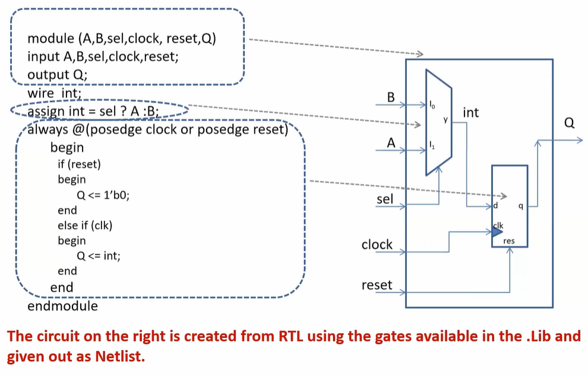

# 🔹 Day 1 – Skill 3: Introduction to Yosys and Logic Synthesis

---

## Lessons

## L1 – Introduction to Yosys

### Synthesizer
- Tool used for coverting the RTL to netlist
- **Yosys** is the synthesizer used in this Session.

### Yosys Setup
- Yosys takes Design and .lib as inputs and gives netlist as output.

  
   
  <em>Figure 1: Yosys Setup with relevent commands</em>

- For reading the design - `read_verilog`
- For reading the .lib - `read_liberty`
- For writing  out the netlist - `write_verilog`

---

### Verify the Synthesis
- We need to verify the systhesis too, to check if we get the similar behaviour.
- We use the same set setup as before, and this time, instead of design we have Netlist as input.

  
   
  <em>Figure 2: Synthesized Netlist Verification Setup</em>

## L2 – Introduction to Logic Synthesis (Part 1)
### RTL Design
- Behavioral representation of the required specification

**IS THIS WHAT WE NEED?**
- No, we need Digital Logic Circuit.

**HOW?** - using logic synthesis

### Synthesis
- RTL to Gate Level Netlist
- The design is converted into gates and the connections are made between gates.
- This is given out as a file called netlist.

### What is .lib
- Collection of logical modules.
- Includes basic gates like AND, OR, NOT, etc.
- Different flavors of same gate
  - 2 input AND Gate
    - SLow
    - Medium
    - Fast
  - 3 input AND Gate
    - SLow
    - Medium
    - Fast
  - and So on...

### Why Different Flavours of Gates

- ⚡ **Speed:** Some gate implementations are faster for critical paths.  
- 🔋 **Power:** Low-power versions reduce energy consumption.  
- 🏗️ **Area:** Fewer transistors save silicon area.  
- 🛡️ **Noise Margin:** Certain styles are more robust to voltage/noise variations.  
- 🧰 **Synthesis-Friendly:** Standard-cell libraries provide pre-characterized options for easy optimization.

## L3 – Introduction to Logic Synthesis (Part 2)

### Faster Cells vs. Slower Cells
- Load in Digital Logic Circuit -> Capacitance
- Fater the charging/discharging of cap -> Lesser the cell delay.
  - To charge/discharge the capacitance fast, we need transistors capable of sourcing more current.
  - Wider transistors -> Low Delay -> More Area and Power as well !!
  - Narrow transistors -> More Delay -> Less Area and Power
  - Faster Cells donot come free, they come at penalty of area and power.

### Selection of Cells
- Need to guide the synthesizer to select the flavor of cells that is optimum for the implementation of logic circuit.
- More use of faster cells
  - Bad circuit in terms of Power and Area
  - Hold time violations ??
- More use of slower cells
  - Sluggish circuit, may not meet the performance need
- The guidance offered to the Synthesizer -> "Constraints"

### Synthesis (Illustration)

  
   
  <em>Figure 3: Illustration of Synthesis</em>

---

- 📄 [Go to Day 1 Skill 4](./D1SK4_Labs_with_Yosys_and_Sky130PDK.md)
- 📄 [Go to Week 1 Day 1 details](./W1_D1_readme.md)
- 📄 [Go to Week 1 details](../Week_1_readme.md)

