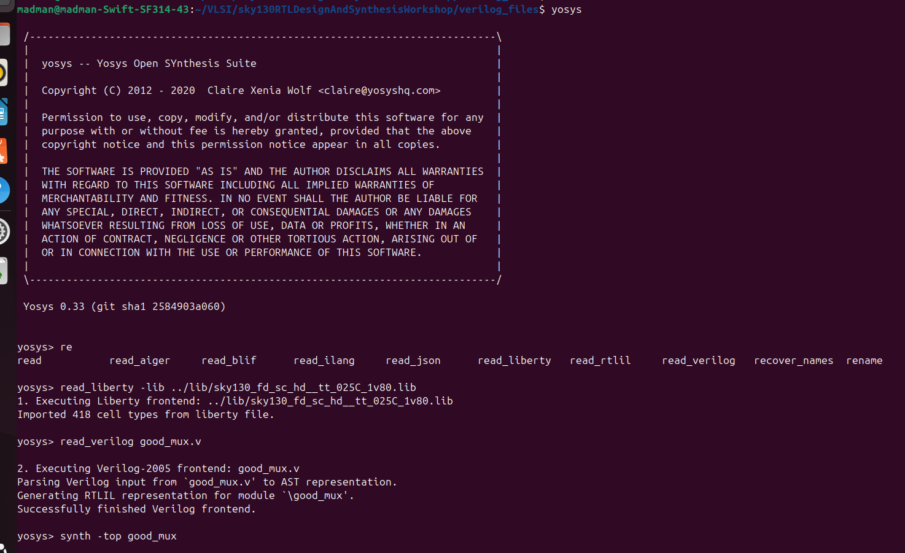
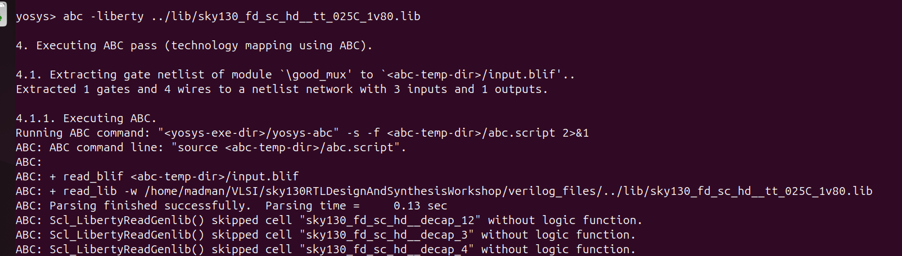
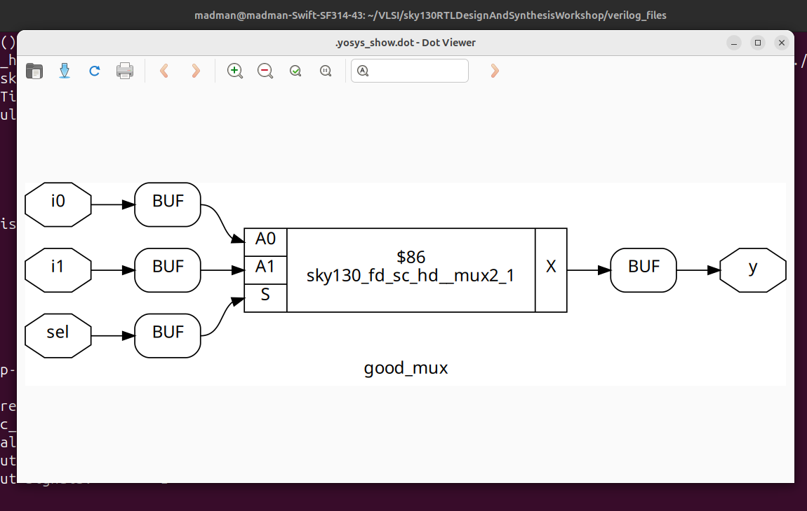
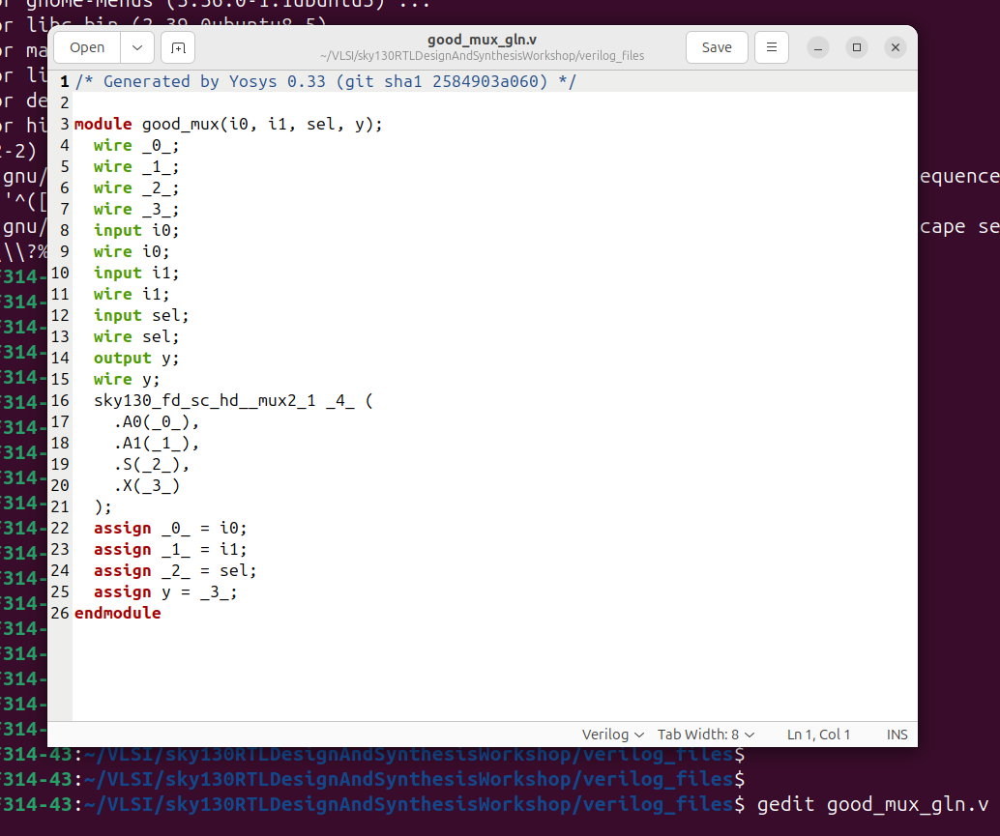

# 🔹 Day 1 – Skill 4: Labs using Yosys and Sky130 PDKs
---

## Lessons

## L1 – Lab3: Yosys – 1 Good MUX (Part 1)

In this lab we will synthesize the design (which we simulated before) in yosys.
- We have already installed the required tools.

We will start with being present in `~/VLSI/sky130RTLDesignAndSynthesisWorkshop/verilog_files`

**Step 1: Start Yosys**

````bash
yosys
````

**Step 2: Read the input - .lib and .v**

````bash
read_liberty -lib ../lib/sky130_fd_sc_hd__tt_025C_1v80.lib
read_verilog good_mux.v
````

**Step 3: Start synthesizing and generate netlist**

````bash
synth -top good_mux
abc -liberty ../lib/sky130_fd_sc_hd__tt_025C_1v80.lib
show
````
- mentioning the top module of our design
- Technology mapping using ABC
- show to see the graphical representation of realised circuit.

<p align="center">
  
  <br/>
  <em>Figure 1: Starting yosys and giving the required inputs</em>
</p>

<p align="center">
  
  <br/>
  <em>Figure 2: Technology Mapping with ABC</em>
</p>

---

<p align="center">
  
  <br/>
  <em>Figure 3: Graphical Representation of the Synthesized Mux Design</em>
</p>


---

## L2 – Lab3: Yosys – 1 Good MUX (Part 2)

- We saw the graphical represntation of the synthesized design.
- We can also see manually that the logic verifies with design intended as it is very small design, a mux to be precise.

---

## L3 – Lab3: Yosys – 1 Good MUX (Part 3)

**Step 4: Write the generated netlist**

````bash
write_verilog -noattr good_mux_gln.v
````

- noattr switch to have atributes in written netlist.
- We can observe the netlist in any editor.

<p align="center">
  
  <br/>
  <em>Figure 4: Gate level netlist of the synthesized design</em>
</p>


---

- 📄 [Go to Day 2 Skill 1](./D2SK1_Introduction_to_dot_lib.md)
- 📄 [Go to Week 1 Day 1 details](./W1_D1_readme.md)
- 📄 [Go to Week 1 details](../Week_1_readme.md)


