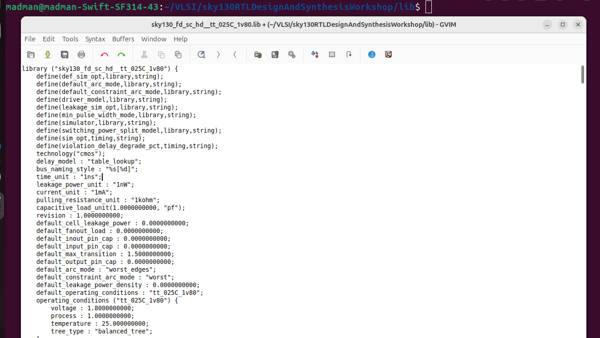

# 🔹 Day 2 – Skill 1: Introduction to Timing .lib Files

---

## Lessons

## L1-L3 – Lab4: Introduction to .lib 

We already discussed about the `.lib` files before. Here we will take a glimpse of it's contents.
- `.lib` file starts with the intoduction to technology.
- In our case it is `sky130_fd_sc_hd__tt_025c_1v80`

Lets decode it: **`sky130_fd_sc_hd__tt_025c_1v80`**

- sky130 : Skywater 130nm process technology
- fd : foundary provided library
- sc : Standard cells library
- hd : High Density Librray

The later part gives the idea of **PVT**.

Process Voltage Temperature (Operating Conditions)
- Process : tt : Typical Corner
- Voltage : 1v80 : 1.8 Volts Operating Voltage
- Temperature : 025c : 25 degrees Celcius.

We can also get idea of delay model used, units, delays tables, leakage power of the gates, etc.

  
   
  <em>Figure 1: Glimpse of the .lib file being used</em>

---

Here we can see the snapshot of delay tables present in the .lib file.

  
   
  <em>Figure 2: How delay table are stored in the .lib file</em>

---

### Different flavours of gates

- Here we can notice similar gate with different sizing, signifying, increased size and power, meanwhile the delay is reduced

  
   
  <em>Figure 3: Same cell with different sizes present in .lib file.</em>

---
