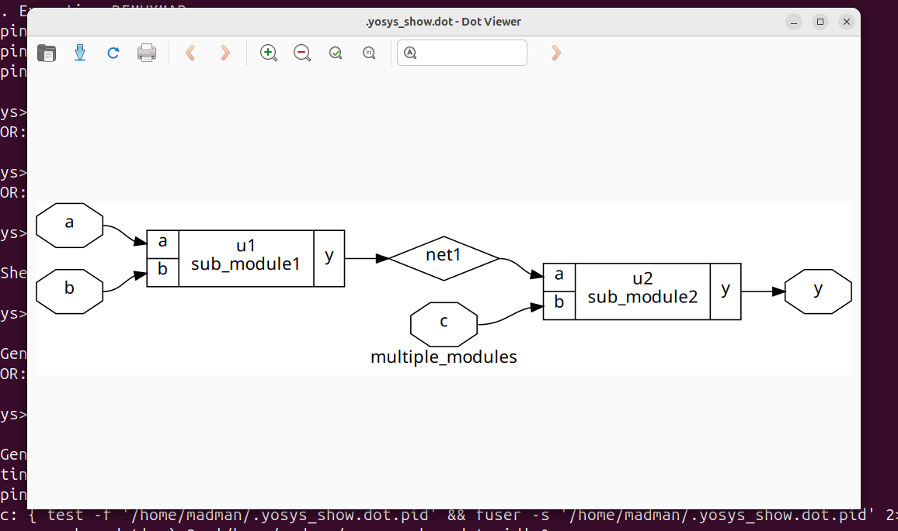
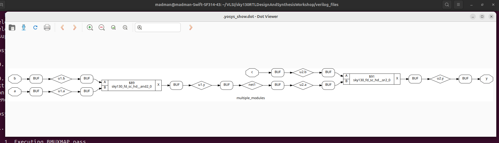
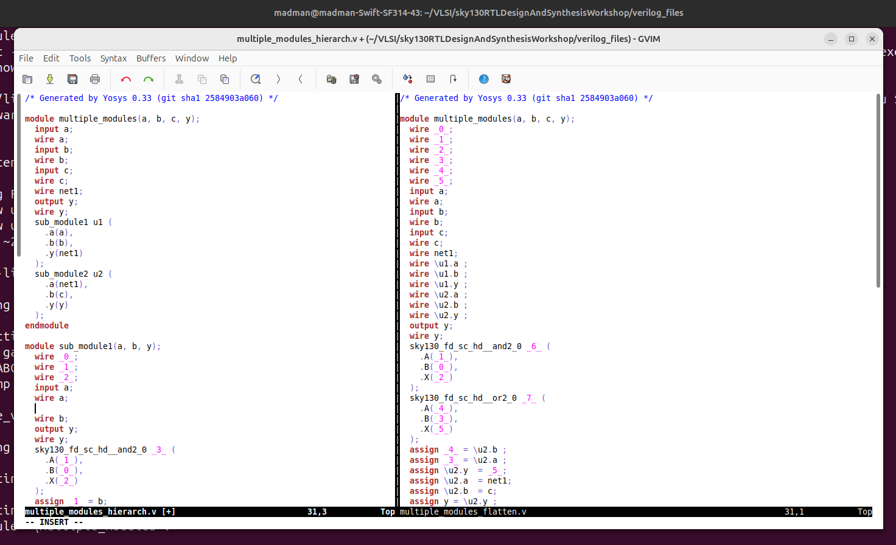

# 🔹 Day 2 – Skill 2: Hierarchical vs Flat Synthesis

---

## Lessons

## L1 – Lab05: Hierarchical vs Flat Synthesis (Part 1)

### Hierarchical Synthesis

- Synthesis tool processes each module separately, preserving the design hierarchy.
- Lets say we have a design with submodules in it.
- For example:
  
````Verilog
module sub_module2 (input a, input b, output y);
	assign y = a | b;
endmodule

module sub_module1 (input a, input b, output y);
	assign y = a&b;
endmodule


module multiple_modules (input a, input b, input c , output y);
	wire net1;
	sub_module1 u1(.a(a),.b(b),.y(net1));  //net1 = a&b
	sub_module2 u2(.a(net1),.b(c),.y(y));  //y = net1|c ,ie y = a&b + c;
endmodule

````
- Here, sub_module1 and sub_module2 are synthesized as independent modules.
- The top module multiple_modules connects these modules without flattening them.

There are advantages and disadvantages for that.

#### Advantages:

- Simplifies debugging and verification at the module level.
- Enables incremental synthesis — only changed modules need re-synthesis.
- Facilitates module reuse across multiple designs.

#### Disadvantages:

- Limits optimization across module boundaries.
- May result in larger area and less optimal timing compared to flat synthesis.

---

#### Graphical Represntation of Hierarchical Synthesis of Example design

<p align="center">
  
  <br/>
  <em>Figure 1: Hierarchical Synthesis of Example design commands</em>
</p>

---

At the end we will see the comparision of synthesized netlist.

---

## L2 – Lab05: Hierarchical vs Flat Synthesis (Part 2)

### Flat Synthesis
- The synthesis tool flattens the entire design hierarchy, treating all logic as one big module.
- We will consider the same example.

- Here, the logic inside sub_module1, sub_module2, and multiple_modules is combined and synthesized together.

There are advantages and disadvantages for this too.

#### Advantages:

- Enables more aggressive optimizations by considering the whole design globally.
- Can reduce area and improve timing.

#### Disadvantages:

- Longer synthesis runtime.
- Harder to debug and trace signals back to original modules.
- Incremental synthesis is often not possible, requiring full re-synthesis on changes.

#### Graphical Represntation of Flat Synthesis of Example design

<p align="center">
  
  <br/>
  <em>Figure 2: Flat Synthesis of Example design commands</em>
</p>

---

#### Synthesized netlist of Hierarchical synthesis and Flat Synthesis

<p align="center">
  
  <br/>
  <em>Figure 3: Gate level netlist from Hierarchical Synthesis and Flat Synthesis.</em>
</p>

---

- Here we can notice that in the flattened gate level netlist, the submodules are merged and they are lost.
- Meanwhile, in case of hierarchical synthesis, we can even use the submodules and it get synthesized separately.

---
