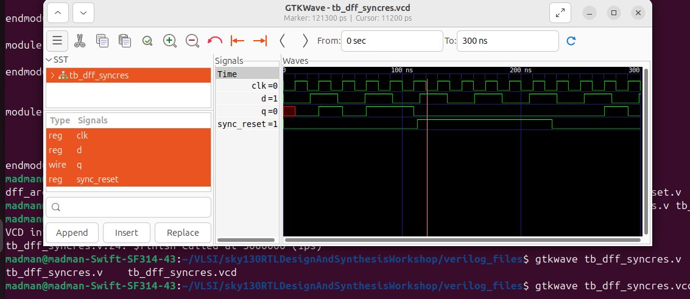
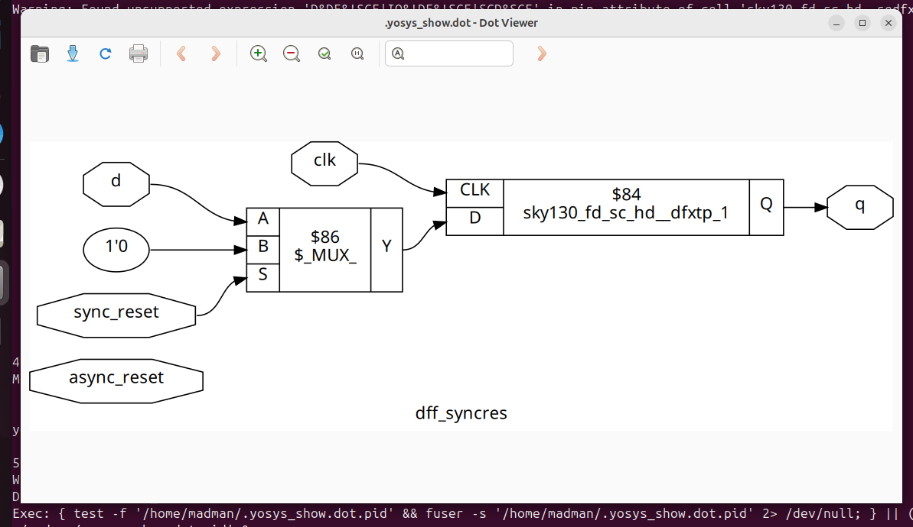

# 🔹 Day 2 – Skill 3: Various Flop Coding Styles and Optimization

---

## Lessons

## L1-L2 – Why Flops and Flop Coding Styles

Now, we have different elements in a circuit, and that includes clock too. This introduces sequential elements along with it.
- Flip-FLops are essential part of this.
- They are edge sensitive sequential element that can store bits, bytes and bits ofc.
- Along with their normal operation to store data at edge, they have set and reset functionality too.
- These functionalities can be synchronous or asynchronous or both.
- We will look at some such design.


#### Flip-FLop design with Synchronous Reset

````Verilog
module dff_syncres ( input clk , input async_reset , input sync_reset , input d , output reg q );
always @ (posedge clk )
begin
	if (sync_reset)
		q <= 1'b0;
	else	
		q <= d;
end
endmodule
````

- Here, we can notice that in the always block, in our sensitivity list, we have clock but no reset.
- Reset is inside the always block, making it a synchronous design.

#### Flip-FLop design with Asynchronous Reset

````Verilog
module dff_asyncres ( input clk ,  input async_reset , input d , output reg q );
always @ (posedge clk , posedge async_reset)
begin
	if(async_reset)
		q <= 1'b0;
	else	
		q <= d;
end
endmodule
````

- Here, our sensitivity list contains the reset making this design asynchronous to begin with.

#### Flip-FLop design with both

````Verilog
module dff_asyncres_syncres ( input clk , input async_reset , input sync_reset , input d , output reg q );
always @ (posedge clk , posedge async_reset)
begin
	if(async_reset)
		q <= 1'b0;
	else if (sync_reset)
		q <= 1'b0;
	else	
		q <= d;
end
endmodule
````

- In this particular flop design, we demonstrated both async and sync reset.

#### Flip-FLop design with Asynchronous Set

````Verilog
module dff_async_set ( input clk ,  input async_set , input d , output reg q );
always @ (posedge clk , posedge async_set)
begin
	if(async_set)
		q <= 1'b1;
	else	
		q <= d;
end
endmodule
````

- In this design, rather than making the output zero at reset, we make output 1 at set signal high.

---

Next we will see the simulation waveform and Synthesized graphical represntation for them.

---

## L3-L4 – Lab: Flop Synthesis Simulations

Let's see the simulation waveform and the graphical synthesised view of all these flops we discussed.

#### Flip-FLop design with Synchronous Reset

<p align="center">
  
  <br/>
  <em>Figure 1: Waveform of DFF with Synchronous Reset </em>
</p>

---

<p align="center">
  
  <br/>
  <em>Figure 2: Synthesized view of DFF with Synchronous Reset </em>
</p>

---

#### Flip-FLop design with Asynchronous Reset


#### Flip-FLop design with both


#### Flip-FLop design with Asynchronous Set


---

## L5-L6 – Interesting Optimisations


---
