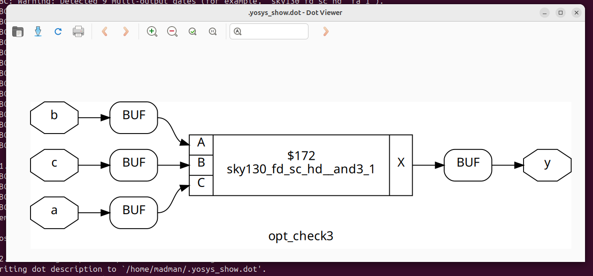
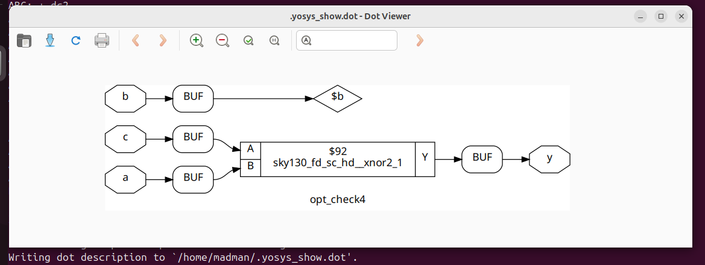
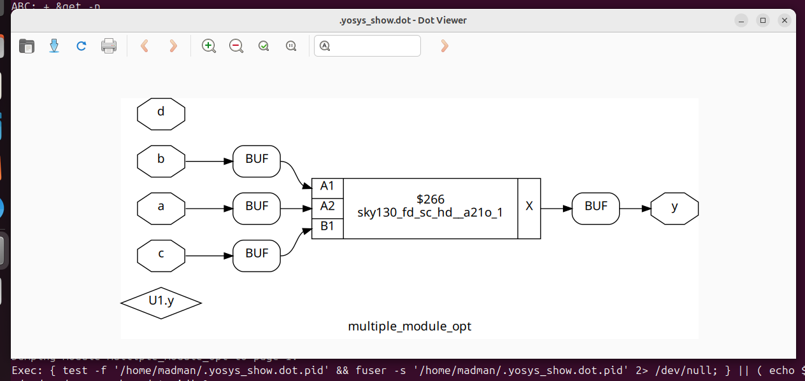
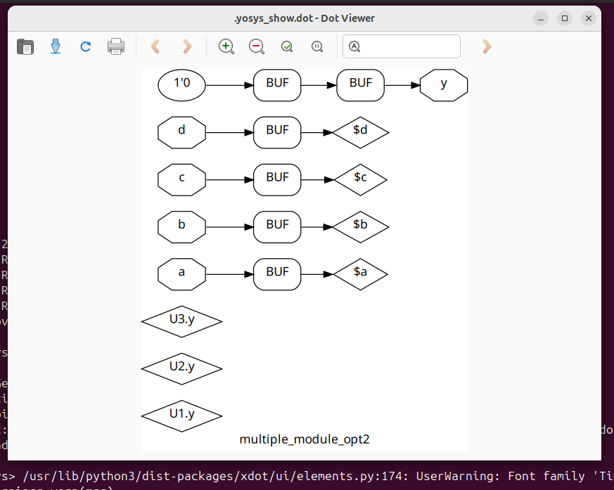

# 🔹 Day 3 – Skill 2: Combinational Logic Optimizations

---

## Lessons

## L1-L2 – Lab06: Combinational Logic Optimisations

In these lab, we will see some optimisations made by synthesis tool `Yosys`.
- We will go through few examples.
- How there design looks like and what they are mapped as.
- We will take 2 views - `design` and `graphical_yosys`

### Examples:

**Number 1** - opt_check.v

````Verilog
module opt_check (input a , input b , output y);
	assign y = a?b:0;
endmodule
````
- Here, we have a mux, when `a = 0`, `y = 0` and when `a = 1`, `y = b`.
- This looks like behaviour of `AND` and can be expressed as `y = a and b`

Let's see what our synthesis tool do on this design.
- Being present in verilog_files folder as in previous labs, we will execute these commands.

````bash
read_liberty -lib ../lib/sky130_fd_sc_hd__tt_025C_1v80.lib 
read_verilog opt_check.v 
synth -top opt_check
opt_clean -purge
abc -liberty ../lib/sky130_fd_sc_hd__tt_025C_1v80.lib
show
write_verilog opt_check_gln.v
````
<p align="center">
  
  <br/>
  <em>Figure 1: Yosys view of Optimisation of a MUX to an AND Gate </em>
</p>


---

**Number 2** - opt_check2.v

````Verilog
module opt_check2 (input a , input b , output y);
	assign y = a?1:b;
endmodule
````

- Here, we have a mux, when `a = 0`, `y = b` and when `a = 1`, `y = 1`.
- This behaviour can be expressed as `y = a or ((not a) and b)`
- This is nothing but `OR` of a and b.

Let's see what our synthesis tool do on this design. 

<p align="center">
  
  <br/>
  <em>Figure 2: Yosys view of Optimisation of a MUX to an OR Gate </em>
</p>


----

**Number 3** - opt_check3.v

````Verilog
module opt_check3 (input a , input b, input c , output y);
	assign y = a?(c?b:0):0;
endmodule
````

- Here, we have a mux, when `a = 0`, `y = 0` and
- When `a = 1`, we look into c.
  - If `c = 1`, then `y = b` else `y = 0`
- This behaviour can be expressed as `y = a and ( c and b)`
- This is nothing but `AND` of a, b, and c.

Let's see what our synthesis tool do on this design. 

<p align="center">
  
  <br/>
  <em>Figure 3: Yosys view of Optimisation of 2 MUX to a 3-input AND Gate </em>
</p>


----

**Number 4** - opt_check4.v

````Verilog
module opt_check4 (input a , input b , input c , output y);
	assign y = a?(b?(a & c ):c):(!c);
endmodule
````

- Here, we have a mux, when `a = 0`, `y = not c` and
- When `a = 1`, we look into b.
  - If `b = 1`, then `y = a and c` else `y = c`
- This simplifies as `XNOR Gate` only - `y = a xnor c`.
- Let's see what our synthesis tool do on this design. 

<p align="center">
  
  <br/>
  <em>Figure 4:  Yosys view of Optimisation of 2 MUX to a XNOR Gate  </em>
</p>

----

**Number 5** - multiple_module_opt.v

````Verilog
module sub_module1(input a , input b , output y);
 assign y = a & b;
endmodule


module sub_module2(input a , input b , output y);
 assign y = a^b;
endmodule


module multiple_module_opt(input a , input b , input c , input d , output y);
wire n1,n2,n3;

sub_module1 U1 (.a(a) , .b(1'b1) , .y(n1));
sub_module2 U2 (.a(n1), .b(1'b0) , .y(n2));
sub_module2 U3 (.a(b), .b(d) , .y(n3));

assign y = c | (b & n1); 


endmodule
````

- Here, we have a design with multiple module.
- We can notice that we have used 2 modules here, but when we flatten the design, we observe that `n1 = a` and n2 and n3 are never used.
- So the output expression is `y = c or (a and b)`
- These are the commands we run in the yosys to get view of its optimisation.
  
````bash
read_liberty -lib ../lib/sky130_fd_sc_hd__tt_025C_1v80.lib
read_verilog multiple_module_opt.v 
synth -top multiple_module_opt 
flatten
opt_clean -purge
abc -liberty ../lib/sky130_fd_sc_hd__tt_025C_1v80.lib 
show
write_verilog multiple_module_opt_gln.v
````


<p align="center">
  
  <br/>
  <em>Figure 5:  Yosys view of Optimisation of multiple modules to simple AND-OR function </em>
</p>

----

**Number 6** - multiple_module_opt2.v

````Verilog
module sub_module(input a , input b , output y);
 assign y = a & b;
endmodule


module multiple_module_opt2(input a , input b , input c , input d , output y);
wire n1,n2,n3;

sub_module U1 (.a(a) , .b(1'b0) , .y(n1));
sub_module U2 (.a(b), .b(c) , .y(n2));
sub_module U3 (.a(n2), .b(d) , .y(n3));
sub_module U4 (.a(n3), .b(n1) , .y(y));

endmodule
````

- Here, we have a design with multiple module.
- We can notice that we have used 1 module and instantiated it 4 times. The operation performed by submodule is `AND`
- Here, `n1 = 0` as one of the input is 0. In U4, where we have our output, one of the input is n1, this leads to the conclusion that `y = 0`.
  

<p align="center">
  
  <br/>
  <em>Figure 6:  Yosys view of Optimisation of multiple modules to constant propagation to output </em>
</p>

----
