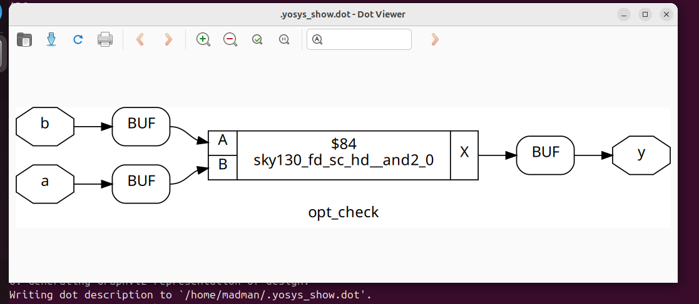
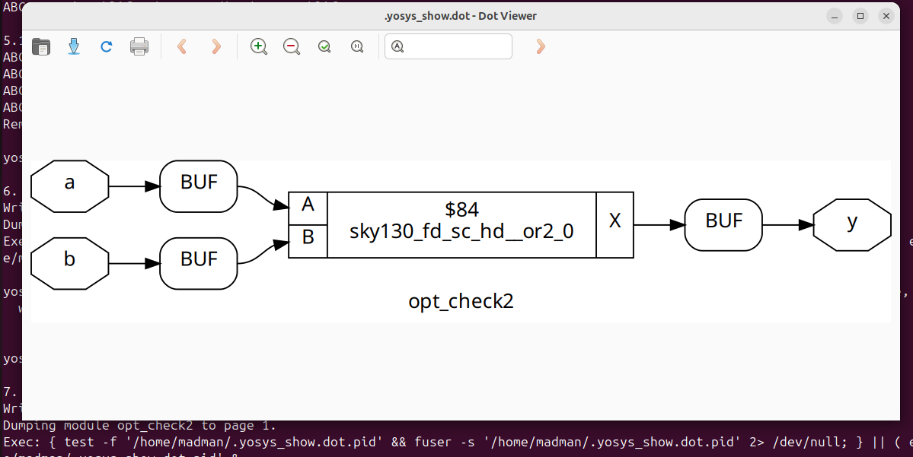

# 🔹 Day 3 – Skill 2: Combinational Logic Optimizations

---

## Lessons

## L1-L2 – Lab06: Combinational Logic Optimisations

In these lab, we will see some optimisations made by synthesis tool `Yosys`.
- We will go through few examples.
- How there design looks like and what they are mapped as.
- We will take 2 views - `design` and `graphical_yosys`

### Examples:

**Number 1** - opt_check.v

````Verilog
module opt_check (input a , input b , output y);
	assign y = a?b:0;
endmodule
````
- Here, we have a mux, when `a = 0`, `y = 0` and when `a = 1`, `y = b`.
- This looks like behaviour of `AND` and can be expressed as `y = a and b`

Let's see what our synthesis tool do on this design.
- Being present in verilog_files folder as in previous labs, we will execute these commands.

````bash
read_liberty -lib ../lib/sky130_fd_sc_hd__tt_025C_1v80.lib 
read_verilog opt_check.v 
synth -top opt_check
opt_clean -purge
abc -liberty ../lib/sky130_fd_sc_hd__tt_025C_1v80.lib
show
write_verilog opt_check_gln.v
````
<p align="center">
  
  <br/>
  <em>Figure 1: Yosys view of Optimisation of a MUX to an AND Gate </em>
</p>


---

**Number 2** - opt_check2.v

````Verilog
module opt_check2 (input a , input b , output y);
	assign y = a?1:b;
endmodule
````

- Here, we have a mux, when `a = 0`, `y = b` and when `a = 1`, `y = 1`.
- This behaviour can be expressed as `y = a + a'b`
- This is nother but `OR` of a and b.

Let's see what our synthesis tool do on this design. 

<p align="center">
  
  <br/>
  <em>Figure 2: Yosys view of Optimisation of a MUX to an OR Gate </em>
</p>


----
