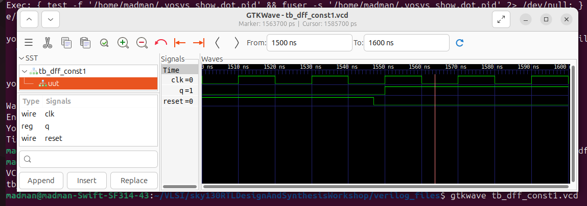
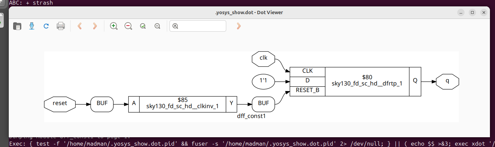
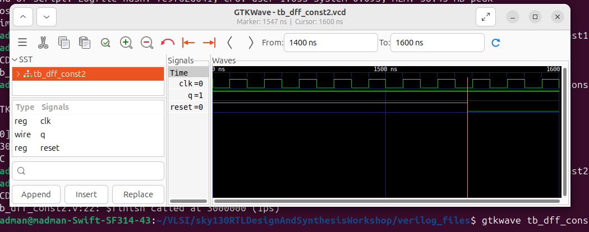
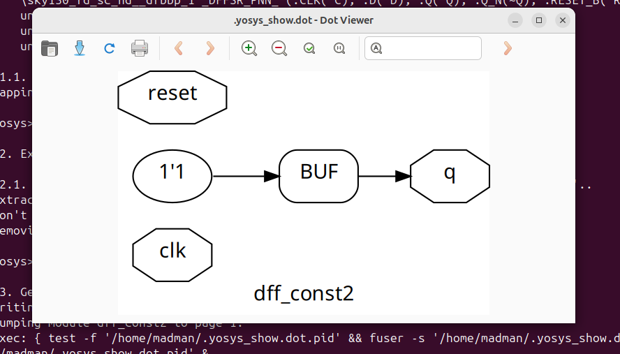
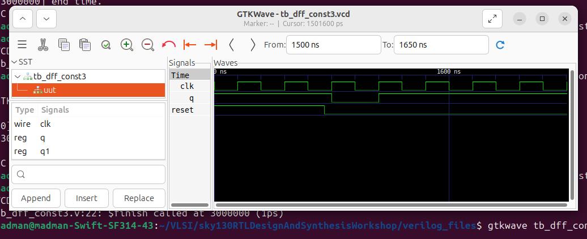
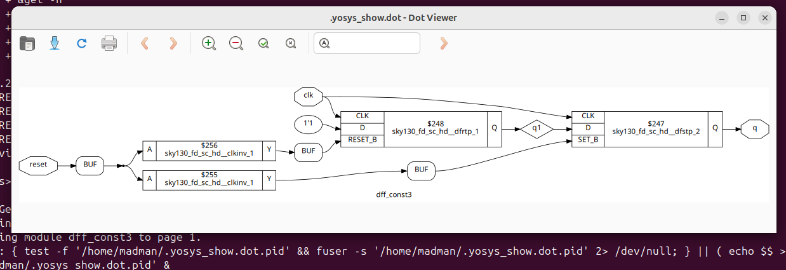
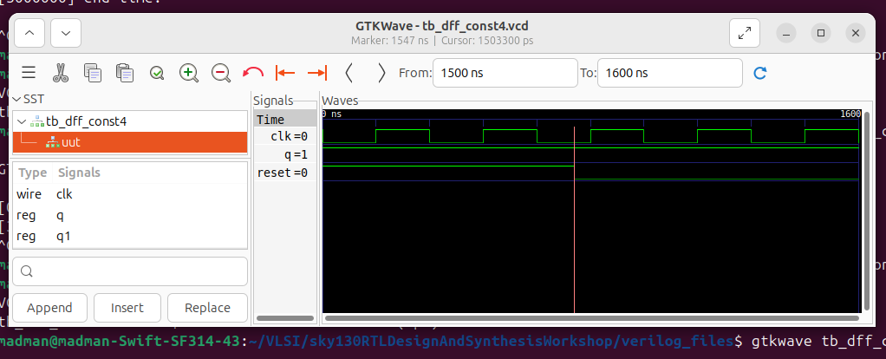
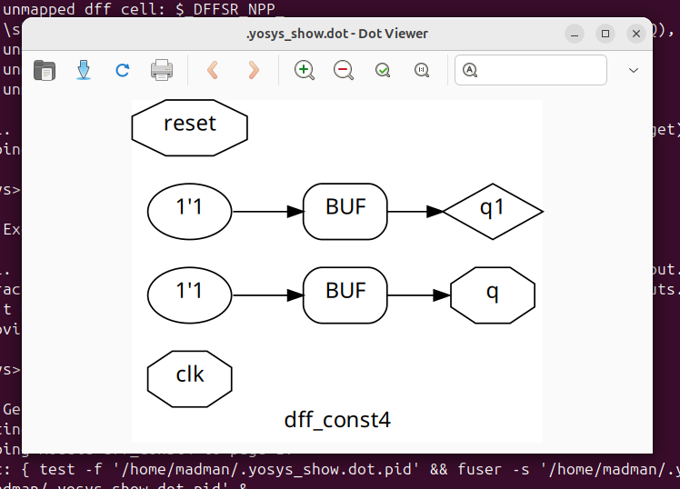
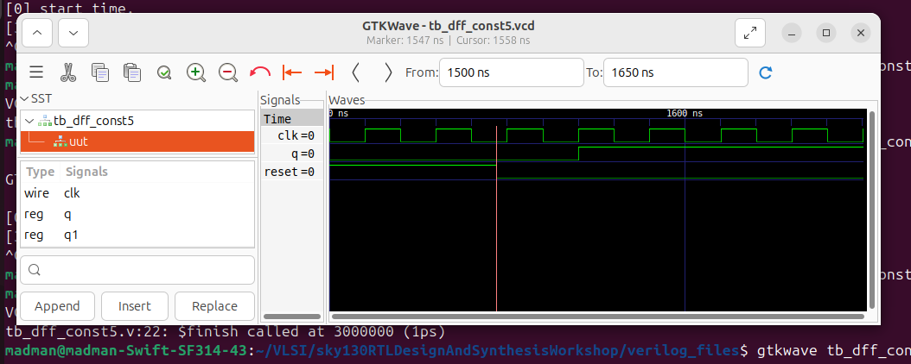
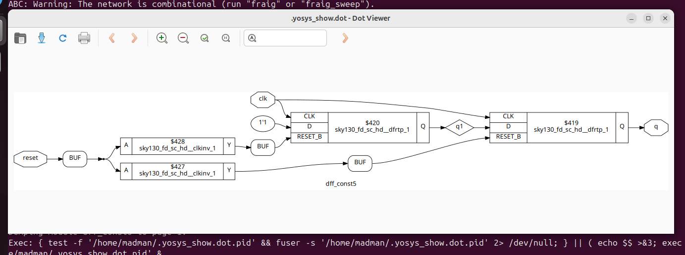

# 🔹 Day 3 – Skill 3: Sequential Logic Optimizations

---

## Lessons

## L1-L3 – Lab07: Sequential Logic Optimisations

In these lab, we will see some optimisations made by synthesis tool `Yosys` in Sequential Circuits.
- We will go through few examples.
- How there design looks like and what they are mapped as.
- We will take 3 views - `design`, `simulation` and `graphical_yosys`


### Examples:

**Number 1** - dff_const1.v

````Verilog
module dff_const1(input clk, input reset, output reg q);
always @(posedge clk, posedge reset)
begin
	if(reset)
		q <= 1'b0;
	else
		q <= 1'b1;
end

endmodule
````
- Here, we have a dff, upon reset application `reset = 1`, next value taken by q is 0, and when `reset = 0`, next value taken by q is 1.
- This behaviour is like q is `not` of reset, but with edge sensitivity.
- This should synthesis as dff but, with `not reset` behaviour.

Let's see what our synthesis tool do on this design.
- Being present in verilog_files folder as in previous labs, we will execute these commands.

````bash
read_liberty -lib ../lib/sky130_fd_sc_hd__tt_025C_1v80.lib 
read_verilog dff_const1.v 
synth -top dff_const1
dfflibmap -liberty ../lib/sky130_fd_sc_hd__tt_025C_1v80.lib 
abc -liberty ../lib/sky130_fd_sc_hd__tt_025C_1v80.lib 
show
````

---

<p align="center">
  
  <br/>
  <em>Figure 1: Simulation of above design - dff_const1.v </em>
</p>

---

<p align="center">
  
  <br/>
  <em>Figure 2: Yosys view of Optimisation of dff_const1.v </em>
</p>

---

**Number 2** - dff_const2.v

````Verilog
module dff_const2(input clk, input reset, output reg q);
always @(posedge clk, posedge reset)
begin
	if(reset)
		q <= 1'b1;
	else
		q <= 1'b1;
end

endmodule
````

- Here, we have a dff with output assigned to 1 in both cases, application of reset or normal operation.
- This should synthesis as a constant propagation to the output `q = 1`.

Let's see what our synthesis tool do on this design. 

---

<p align="center">
  
  <br/>
  <em>Figure 3: Simulation of above design - dff_const2.v </em>
</p>

- Here we can see that with reset or without reset, the output is 1.

---

<p align="center">
  
  <br/>
  <em>Figure 4: Yosys view of Optimisation of dff_const2.v </em>
</p>


----

**Number 3** - dff_const3.v

````Verilog
module dff_const3(input clk, input reset, output reg q);
reg q1;

always @(posedge clk, posedge reset)
begin
	if(reset)
	begin
		q <= 1'b1;
		q1 <= 1'b0;
	end
	else
	begin
		q1 <= 1'b1;
		q <= q1;
	end
end

endmodule
````

- Here, in ths dff design, we can see that without reset, under normal operation, value of q1 is assigned to q.
- Now when reset is applied, q is assigned 1, like set behaviour.
- when reset is released, for one cycle, `q1 = 0` and then q goes to 0, just after that, q goes high again.
- Here under both reset and normal operation, q is 1 except when reset is released.
- This might synthesis as a reset flop, followed by set flop.

Let's see what our synthesis tool do on this design. 

---

<p align="center">
  
  <br/>
  <em>Figure 5: Simulation of above design - dff_const3.v </em>
</p>

- We can observe the similar behaviour discussed above.

---

<p align="center">
  
  <br/>
  <em>Figure 6: Yosys view of Optimisation of dff_const3.v </em>
</p>


----

**Number 4** - dff_const4.v

````Verilog
module dff_const4(input clk, input reset, output reg q);
reg q1;

always @(posedge clk, posedge reset)
begin
	if(reset)
	begin
		q <= 1'b1;
		q1 <= 1'b1;
	end
	else
	begin
		q1 <= 1'b1;
		q <= q1;
	end
end

endmodule
````

- Here, in this flip-flop design, we can see that no matter what, q is assigned to 1, wither under reset application directly or through q1 under normal operation.
- So this should again synthesis as constant propagation of 1, without dff element.

---

<p align="center">
  
  <br/>
  <em>Figure 7: Simulation of above design - dff_const4.v </em>
</p>

- Constant value of q can be observed here.

---

<p align="center">
  
  <br/>
  <em>Figure 8: Yosys view of Optimisation of dff_const4.v </em>
</p>


----

**Number 5** - dff_const5.v

````Verilog
module dff_const5(input clk, input reset, output reg q);
reg q1;

always @(posedge clk, posedge reset)
begin
	if(reset)
	begin
		q <= 1'b0;
		q1 <= 1'b0;
	end
	else
	begin
		q1 <= 1'b1;
		q <= q1;
	end
end

endmodule
````

- Here, we have similar design as dff_const3 but the followed flop is also reset here.
- So under reset both q and q1 are assigned to 0 and under normal operation q1 is assigned 1 and q is assigned q.
- This is under the delay of 1 cycle as q will be assigned 0 only when reset is released.
- So under reset, output is 0 and when reset is released, the next to next positive edge we have 1 assigned to q.

---
  
<p align="center">
  
  <br/>
  <em>Figure 9: Simulation of above design - dff_const5.v </em>
</p>

---

<p align="center">
  
  <br/>
  <em>Figure 10: Yosys view of Optimisation of dff_const5.v </em>
</p>

----
