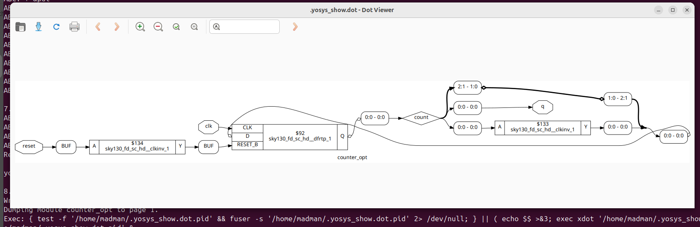
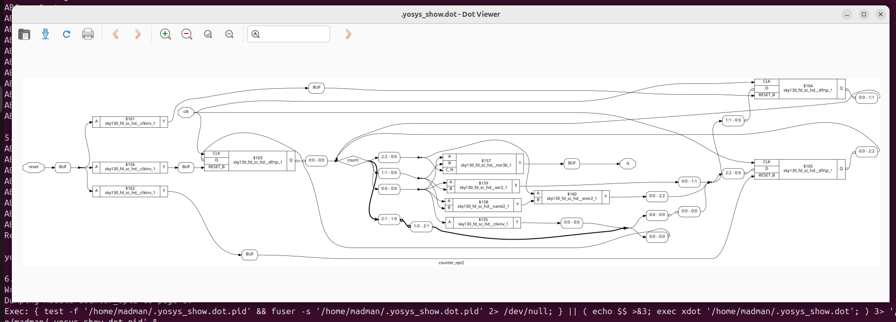

# 🔹 Day 3 – Skill 4: Sequential Optimizations for Unused Outputs

---

## Lessons

## L1-L2 – Sequential optimisation – unused outputs


### Examples:

**Number 1** - counter_opt.v

````Verilog
module counter_opt (input clk , input reset , output q);
reg [2:0] count;
assign q = count[0];

always @(posedge clk ,posedge reset)
begin
	if(reset)
		count <= 3'b000;
	else
		count <= count + 1;
end

endmodule
````
- Here, 
Let's see what our synthesis tool do on this design.
- Being present in verilog_files folder as in previous labs, we will execute these commands.

````bash
read_liberty -lib ../lib/sky130_fd_sc_hd__tt_025C_1v80.lib 
read_verilog counter_opt.v 
synth -top counter_opt 
dfflibmap -liberty ../lib/sky130_fd_sc_hd__tt_025C_1v80.lib 
abc -liberty ../lib/sky130_fd_sc_hd__tt_025C_1v80.lib 
show
````

---

<p align="center">
  
  <br/>
  <em>Figure 1: Yosys view of Optimisation of counter_opt </em>
</p>

---

**Number 2** - counter_opt2.v

````Verilog
module counter_opt2 (input clk , input reset , output q);
reg [2:0] count;
assign q = (count[2:0] == 3'b100);

always @(posedge clk ,posedge reset)
begin
	if(reset)
		count <= 3'b000;
	else
		count <= count + 1;
end

endmodule
````

-

Let's see what our synthesis tool do on this design. 

---

<p align="center">
  
  <br/>
  <em>Figure 2: Yosys view of Optimisation of counter_opt2 </em>
</p>


----

