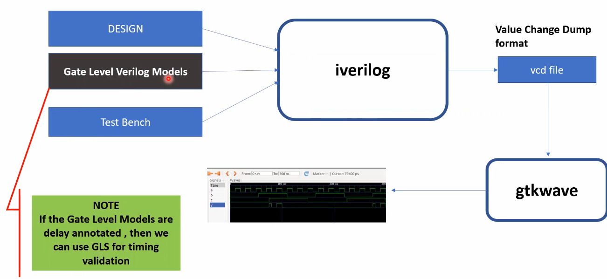

# 🔹 Day 4 – Skill 1: GLS, Synthesis-Simulation Mismatch, and Blocking/Non-blocking Statements

---

## Lessons

## L1 – GLS Concepts and Flow Using Iverilog

### What is GLS - Gate Level Simulation
- Running the testbench with Netlist as Design Under Test.
- Netlist is logically same as RTL Code.
  - Same Testbench will align with the Design
 
### Why GLS
- Verify the logical correctness of design after synthesis
- Ensuring the timing of the design is met.
  - For this, GLS needs to be run with delay annotation.
 
### GLS using IVERILOG
---

<p align="center">
  
  <br/>
  <em>Figure 1: Iverilog setup for Gate Level Simulation</em>
</p>

---

- **Main Focus for us**: Functional Domain.

---

## L2 – Synthesis-Simulation Mismatch

### Why it can happen ?
- Missing sensitivity list
- Blocking vs. Non-Blocking Assignments
- Non-standard verilog coding

---

### Missing Sensitivity List

**Example**
````Verilog
module mux (
  input i0, i1,
  input sel,
  output reg y
);

always@(sel) begin
  if (sel)
      y = i1;
  else
      y = i0;
end

endmodule
````

- Simulator works based on activity, output changes only when input changes.
- In our example, it is based on sel only, is it correct to just mention sel in sensitivity list. No, it is not.
- Why? Because, it says that change output only when sel is changing, which means the output y won't follow i1 or i0 every cycle, but only when sel is changed.
- **This is not intended behaviour.**

What can be done right?

````Verilog
module mux (
  input i0, i1,
  input sel,
  output reg y
);

always@(*) begin
  if (sel)
      y = i1;
  else
      y = i0;
end

endmodule
````

- Here, it says that change output based on changes in all inputs not just sel like last time. Always evaluates when any signal changes.
- During synthesis, we will get a mux this time, rather than double edge flop like last example which is unintended.

---

## L3 – Blocking and Non-blocking Statements in Verilog

- Inside always block
  - = -> BLocking
    - Executes the statements in the order it is written.
    - So the first statement is evaluated before the second statement.
  - <= -> Non-BLocking
    - Executes all the RHS when always block is entered and assign to LHS.
    - Parallel Execution

---

## L4 – Caveats with Blocking Statements


#### 1. Trying to implement Shift Register
````Verilog
module code (input clk,
            input reset,
            input d,
            output reg q);

reg q0;

always@(posedge clk or posedge reset) begin
  if (reset) begin
    q0 = 1'b0;
    q1 = 1'b0;
  end else begin
    q = q0; //S1
    q0 = d; //S2
  end
end

endmodule     
````

````Verilog
module code (input clk,
            input reset,
            input d,
            output reg q);

reg q0;

always@(posedge clk or posedge reset) begin
  if (reset) begin
    q0 = 1'b0;
    q1 = 1'b0;
  end else begin
    q0 = d;  //S3
    q = q0;  //S4
    
  end
end

endmodule     
````

---

#### 2. Causing Synthesis Simulation Mismatch

````Verilog
// Design 1
module code(input a, b, c,
      output reg y);

reg q0;
always@(*) begin
    y = q0 & c; 
    q0 = a | b;
end

endmodule
````

- Here, q0 value is the old q0 value, mimicing a delays/flop.

After changing the order,

````Verilog
// Design 2
module code(input a, b, c,
      output reg y);

reg q0;
always@(*) begin
    q0 = a | b;
    y = q0 & c;
end

endmodule
````
- Now, the latest value of q0 is given to expression of y causing no mismatch.

- Both the design 1 and 2 will syntheize to same circuit, leading to synthesis simulation mismatch in design 1 as it behaves like it contains flop.

---


---
