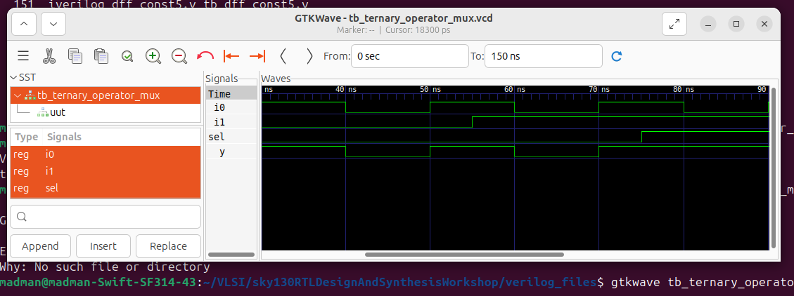
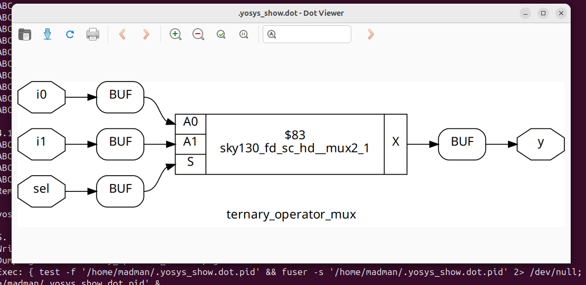
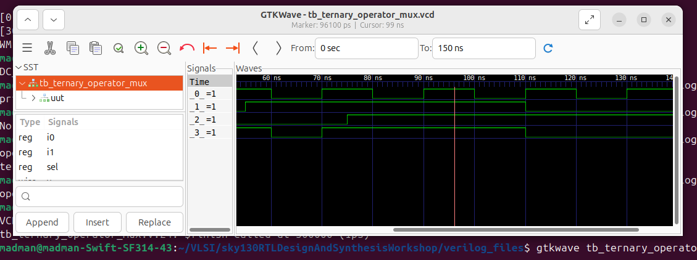

# 🔹 Day 4 – Skill 2: Labs on GLS and Synthesis-Simulation Mismatch

---

## Lessons

## L1-L2 – Lab – GLS Synthesis Simulation Mismatch 

We will start with a good mux using ternary operator and see how to perform gate level simulation. Then we will go on to a design thta will lead to synthesis-simulation mismatch.

#### Normal design - ternary_operator_mux.v

````Verilog
module ternary_operator_mux (input i0 , input i1 , input sel , output y);
	assign y = sel?i1:i0;
endmodule
````

- Here, when `sel = 1`, `y = i1` and when `sel = 0`, `y = i0`.

We will perform RTL Simulation and Gate Level Simulation for this design and compare the results to check for synthesis-simulation mismatch.
---

**For RTL Simulation:**
````bash
iverilog ternary_operator_mux.v tb_ternary_operator_mux.v 
./a.out 
gtkwave tb_ternary_operator_mux.vcd
````

<p align="center">
  
  <br/>
  <em>Figure 1: RTL Simulation of the above mux design</em>
</p>

---

<p align="center">
  
  <br/>
  <em>Figure 2: Yosys representation of the synthesized design - ternary_operator_mux.v</em>
</p>

**For GLS:**
````bash
iverilog ../my_lib/verilog_model/primitives.v  ../my_lib/verilog_model/sky130_fd_sc_hd.v ternary_operator_mux_gln.v tb_ternary_operator_mux.v
./a.out 
gtkwave tb_ternary_operator_mux.vcd
````

<p align="center">
  
  <br/>
  <em>Figure 1: Gate Level Simulation of the above mux design</em>
</p>

---


