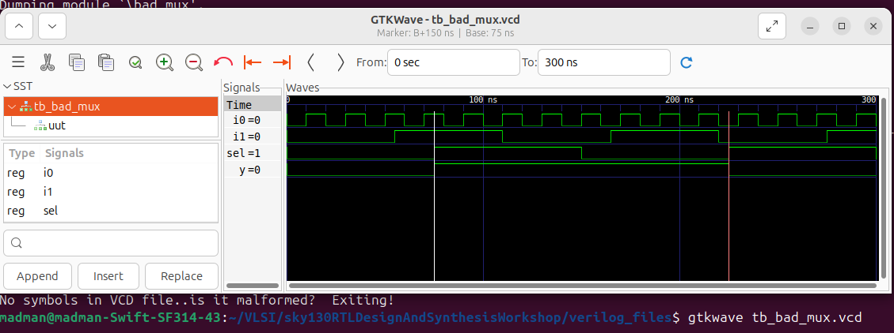
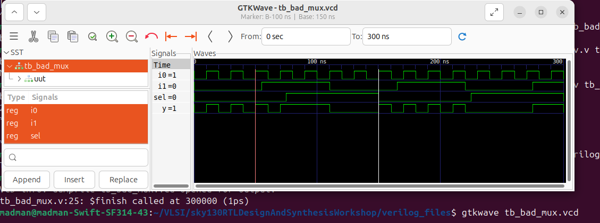

# 🔹 Day 4 – Skill 2: Labs on GLS and Synthesis-Simulation Mismatch

---

## Lessons

## L1-L2 – Lab – GLS Synthesis Simulation Mismatch 

We will start with a good mux using ternary operator and see how to perform gate level simulation. Then we will go on to a design thta will lead to synthesis-simulation mismatch.

#### Normal design - ternary_operator_mux.v

````Verilog
module ternary_operator_mux (input i0 , input i1 , input sel , output y);
	assign y = sel?i1:i0;
endmodule
````

- Here, when `sel = 1`, `y = i1` and when `sel = 0`, `y = i0`.

---

<p align="center">
  
  <br/>
  <em>Figure 1: Yosys representation of the synthesized design - ternary_operator_mux.v</em>
</p>

---

We will perform RTL Simulation and Gate Level Simulation for this design and compare the results to check for synthesis-simulation mismatch.
---

**For RTL Simulation:**
````bash
iverilog ternary_operator_mux.v tb_ternary_operator_mux.v 
./a.out 
gtkwave tb_ternary_operator_mux.vcd
````

---

<p align="center">
  
  <br/>
  <em>Figure 2: RTL Simulation of the above mux design</em>
</p>

---

**For GLS:**
````bash
iverilog ../my_lib/verilog_model/primitives.v  ../my_lib/verilog_model/sky130_fd_sc_hd.v ternary_operator_mux_gln.v tb_ternary_operator_mux.v
./a.out 
gtkwave tb_ternary_operator_mux.vcd
````

<p align="center">
  
  <br/>
  <em>Figure 3: Gate Level Simulation of the above mux design</em>
</p>

---

We can compare waveform in Figure 2 and Figure 3 and see that it matches perfectly.

---

Now we will go ahead and see a design that will lead to synthesis-simulation mismatch.

#### Bad Design - bad_mux.v

````Verilog
module bad_mux (input i0 , input i1 , input sel , output reg y);
always @ (sel)
begin
	if(sel)
		y <= i1;
	else 
		y <= i0;
end
endmodule
````

- Previously, we had discussed the problem with this design, missing sensitivity list.

Let's perform RTL Simulation and Gate Level Simulation for this design and compare the results to check for synthesis-simulation mismatch.
---

**For RTL Simulation:**
````bash
iverilog bad_mux.v tb_bad_mux.v 
./a.out 
gtkwave tb_bad_mux.vcd
````

---

<p align="center">
  
  <br/>
  <em>Figure 4: RTL Simulation of the bad mux design</em>
</p>

---

**For GLS:**
````bash
iverilog ../my_lib/verilog_model/primitives.v  ../my_lib/verilog_model/sky130_fd_sc_hd.v bad_mux_gln.v tb_bad_mux.v
./a.out 
gtkwave tb_bad_mux.vcd
````

<p align="center">
  
  <br/>
  <em>Figure 5: Gate Level Simulation of the bad mux design</em>
</p>

---

- Now, when we compare Figure 4 and 5, we notice huge difference, Waveform in Figure 5 properly dehaves as a mux but that's not the case with RTL simulation of this design.
- In RTL Simulation, output only changes when `sel` signal changes.
- This is a clear example of Synthesis Simulation Mismatch.


