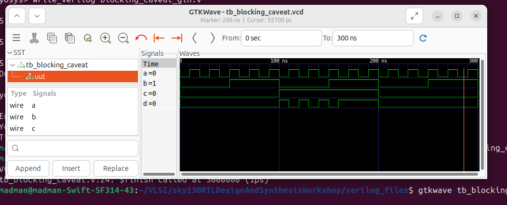
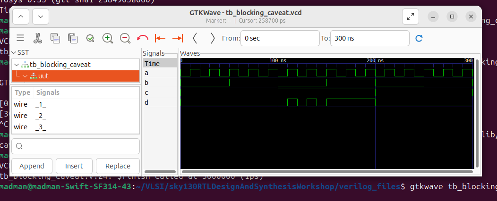
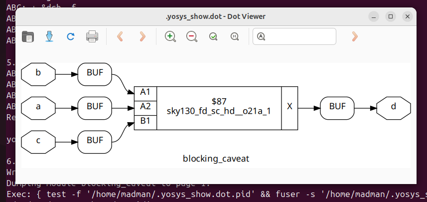

# 🔹 Day 4 – Skill 3: Labs on Synth-Sim Mismatch for Blocking Statements

---

## Lessons

## L1-L2 – Lab – Synthesis vs Simulation Mismatch Blocking Statement 

In this particular lab, we will go through another design thta will lead to synthesis simulation mismatch, this will caused due to blocking statement.

**Example design: blocking_caveats.v**
````Verilog
module blocking_caveat (input a , input b , input  c, output reg d); 
reg x;
always @ (*)
begin
	d = x & c;
	x = a | b;
end
endmodule
````
- One observation we can directly make is the declaration of after it's use.
- This implies that the value of `x` used to calculate `d` is from previous cycle, mimicing flop kind of behaviour.
- Even though the intended behaviour is `OR followed by and`.
- Let's perform RTL Simulation and Gate Level Simulation to see, what's happening.

---

**For RTL Simulation:**
````bash
iverilog blocking_caveats.v tb_blocking_caveats.v 
./a.out 
gtkwave tb_blocking_caveats.vcd
````

---

<p align="center">
  
  <br/>
  <em>Figure 1: RTL Simulation of the above design</em>
</p>

---

**For GLS:**
````bash
iverilog ../my_lib/verilog_model/primitives.v  ../my_lib/verilog_model/sky130_fd_sc_hd.v blocking_caveats_gln.v tb_blocking_caveats.v
./a.out 
gtkwave tb_blocking_caveats.vcd
````

<p align="center">
  
  <br/>
  <em>Figure 2: Gate Level Simulation of the above design</em>
</p>

---

- While comparing the waveform in Figure 1 and Figure 2, we can make some observations.
- First, in figure 1, we see that calculation of d in present cycle is based on previous value of `x = a | b`, meanwhile thats not the case in Gate Level Simulation in Figure 2.
- This shows that Synthesized design shows combinational behavior while RTL shows sequential behaviour.
- This comparision clearly shows the mismatch behaviour while using blocking statements.

---

**Synthesized Representation**

<p align="center">
  
  <br/>
  <em>Figure 3: Synthesized View of the above design in yosys</em>
</p>

---
