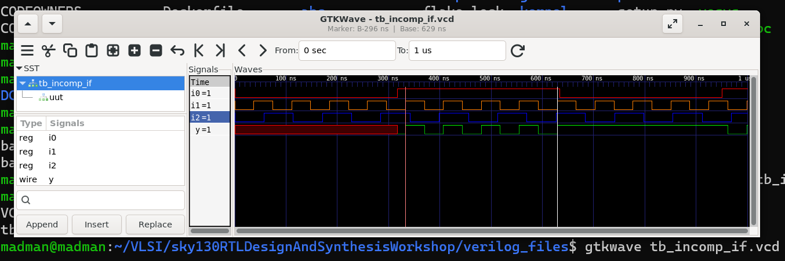
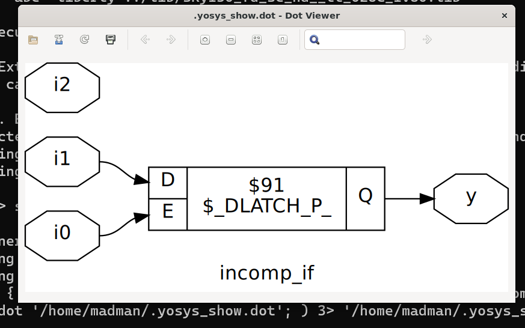
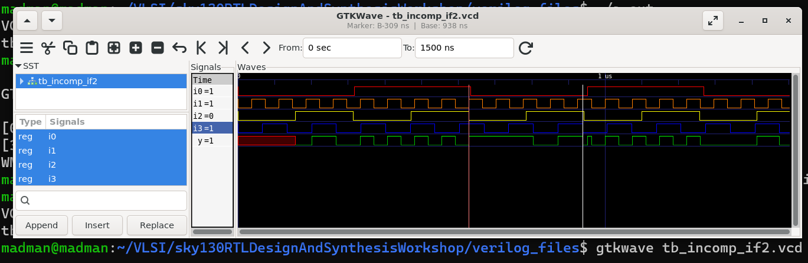
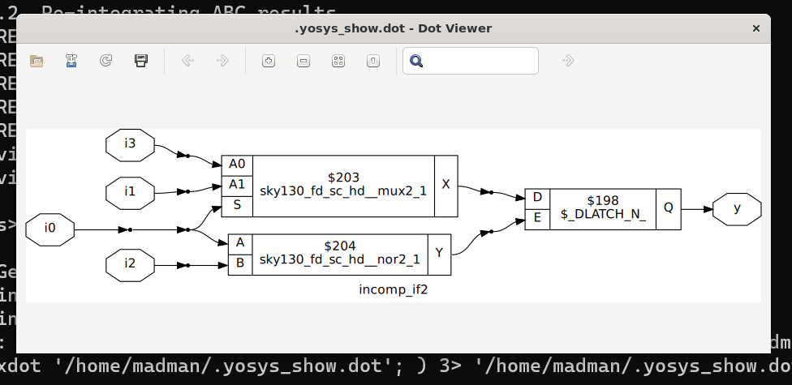

# 🔹 Day 5 – Skill 2: Labs on Incomplete IF

---

## Lessons

## L1 – Lab – Incomplete IF (Part 1)

**Number 1** - incomp_if.v

````Verilog
module incomp_if (input i0 , input i1 , input i2 , output reg y);
always @ (*)
begin
	if(i0)
		y <= i1;
end
endmodule
````

---

<p align="center">
  
  <br/>
  <em>Figure 1: Simulation of above design - incomp_if.v </em>
</p>

---

<p align="center">
  
  <br/>
  <em>Figure 2: Yosys view of Optimisation of incomp_if.v </em>
</p>

---


## L2 – Lab – Incomplete IF (Part 2)

**Number 2** - incomp_if2.v

````Verilog
module incomp_if2 (input i0 , input i1 , input i2 , input i3, output reg y);
always @ (*)
begin
	if(i0)
		y <= i1;
	else if (i2)
		y <= i3;

end
endmodule
````

---

<p align="center">
  
  <br/>
  <em>Figure 3: Simulation of above design - incomp_if2.v </em>
</p>

---

<p align="center">
  
  <br/>
  <em>Figure 4: Yosys view of Optimisation of incomp_if2.v </em>
</p>

---
