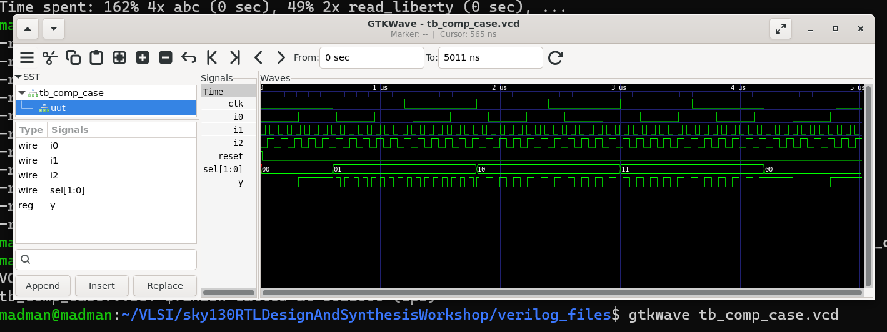
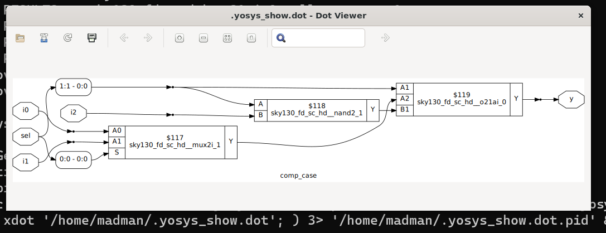
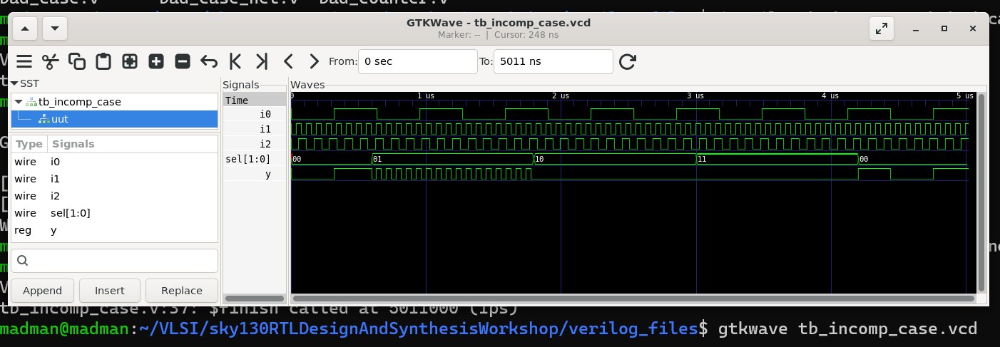
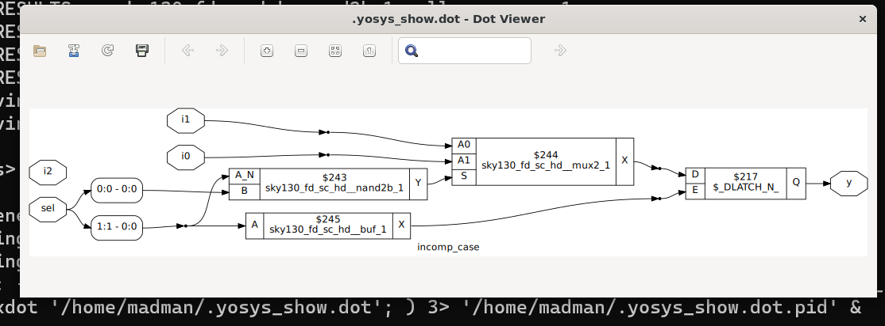
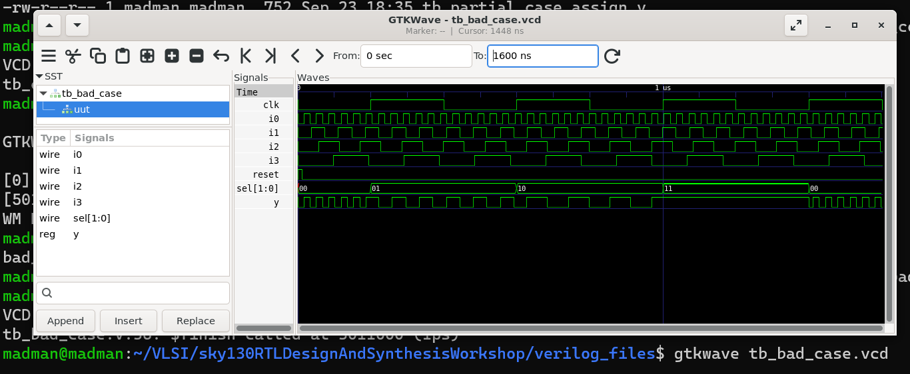
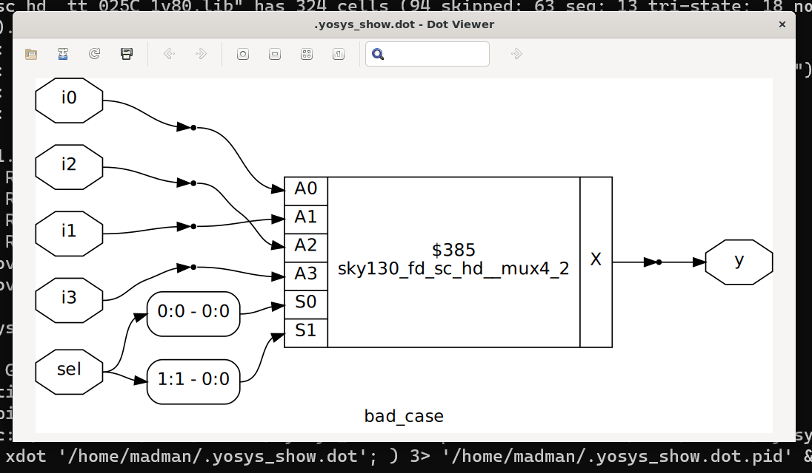
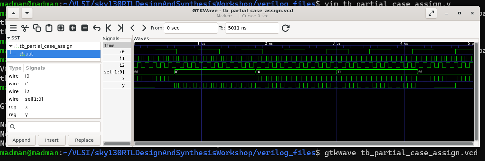
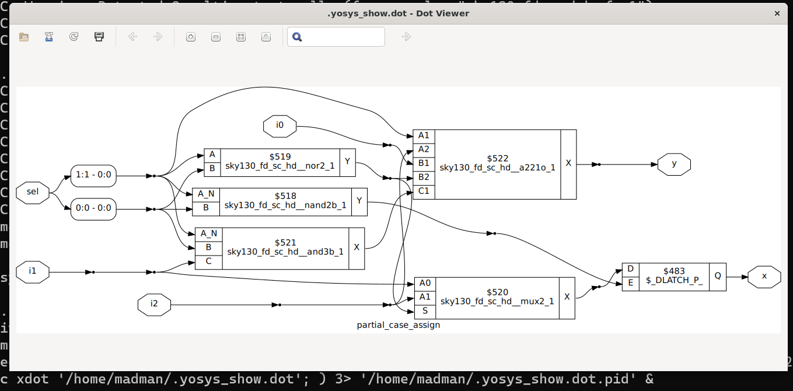

# 🔹 Day 5 – Skill 3: Labs on Incomplete Overlapping CASE

---

## Lessons

## L1 – Lab – Incomplete Overlapping CASE (Part 1)

**Number 1** - comp_case.v

````Verilog
module comp_case (input i0 , input i1 , input i2 , input [1:0] sel, output reg y);
always @ (*)
begin
	case(sel)
		2'b00 : y = i0;
		2'b01 : y = i1;
		default : y = i2;
	endcase
end
endmodule
````
Let's see what our synthesis tool do on this design.
- Being present in verilog_files folder as in previous labs, we will execute these commands.

````bash
read_liberty -lib ../lib/sky130_fd_sc_hd__tt_025C_1v80.lib 
read_verilog comp_case.v 
synth -top comp_case
abc -liberty ../lib/sky130_fd_sc_hd__tt_025C_1v80.lib 
show
````

---

<p align="center">
  
  <br/>
  <em>Figure 1: Simulation of above design - comp_case.v </em>
</p>

---

<p align="center">
  
  <br/>
  <em>Figure 2: Yosys view of Optimisation of comp_case.v </em>
</p>

---


## L2 – Lab – Incomplete Overlapping CASE (Part 2)

**Number 2** - incomp_case.v

````Verilog
module incomp_case (input i0 , input i1 , input i2 , input [1:0] sel, output reg y);
always @ (*)
begin
	case(sel)
		2'b00 : y = i0;
		2'b01 : y = i1;
	endcase
end
endmodule
````

---

<p align="center">
  
  <br/>
  <em>Figure 1: Simulation of above design - incomp_case.v </em>
</p>

---

<p align="center">
  
  <br/>
  <em>Figure 2: Yosys view of Optimisation of incomp_case.v </em>
</p>

---


## L3 – Lab – Incomplete Overlapping CASE (Part 3)

**Number 3** - bad_case.v

````Verilog
module bad_case (input i0 , input i1, input i2, input i3 , input [1:0] sel, output reg y);
always @(*)
begin
	case(sel)
		2'b00: y = i0;
		2'b01: y = i1;
		2'b10: y = i2;
		2'b1?: y = i3;
		//2'b11: y = i3;
	endcase
end

endmodule
````

---

<p align="center">
  
  <br/>
  <em>Figure 1: Simulation of above design - bad_case.v </em>
</p>

---

<p align="center">
  
  <br/>
  <em>Figure 2: Yosys view of Optimisation of bad_case.v </em>
</p>

---


## L4 – Lab – Incomplete Overlapping CASE (Part 4)


**Number 4** - partial_case_assign.v

````Verilog
module partial_case_assign (input i0 , input i1 , input i2 , input [1:0] sel, output reg y , output reg x);
always @ (*)
begin
	case(sel)
		2'b00 : begin
			y = i0;
			x = i2;
			end
		2'b01 : y = i1;
		default : begin
		           x = i1;
			         y = i2;
    end
	endcase
end
endmodule
````

---

<p align="center">
  
  <br/>
  <em>Figure 1: Simulation of above design - partial_case_assign.v </em>
</p>

---

<p align="center">
  
  <br/>
  <em>Figure 2: Yosys view of Optimisation of partial_case_assign.v </em>
</p>

---


