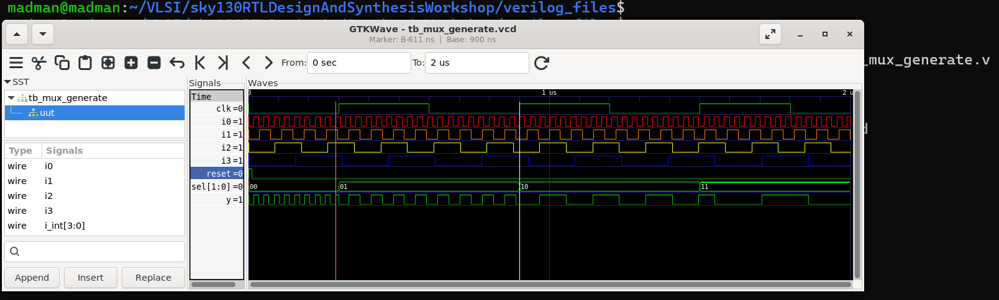
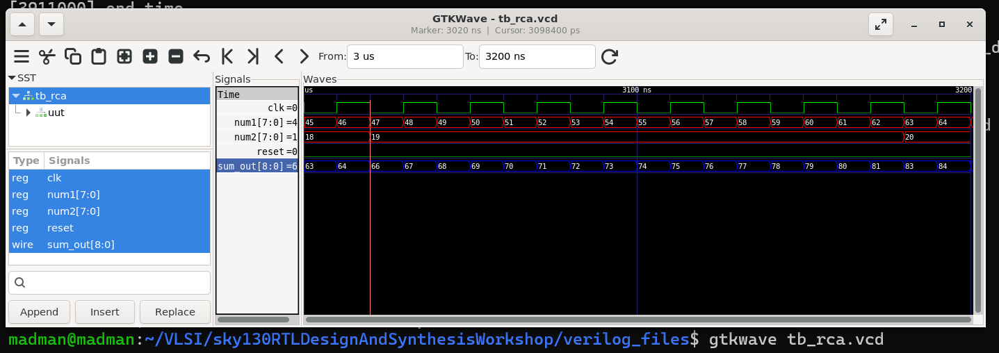

# 🔹 Day 5 – Skill 5: Labs on For Loop and For Generate

---

## Lessons

## L1 – Lab – For and For Generate (Part 1)

We have already discussed the design of mux with case statement. We will discuss about mux using generate construct.

#### MUX design with Generate construct

````Verilog
module mux_generate (input i0 , input i1, input i2 , input i3 , input [1:0] sel  , output reg y);
wire [3:0] i_int;
assign i_int = {i3,i2,i1,i0};
integer k;
always @ (*)
begin
for(k = 0; k < 4; k=k+1) begin
	if(k == sel)
		y = i_int[k];
end
end
endmodule
````

#### Simulation

<p align="center">
  
  <br/>
  <em>Figure 1: Simulation of Mux with generate construct </em>
</p>

---

## L2 – Lab – For and For Generate (Part 2)


#### DEMUX design with Case construct

````Verilog
module demux_case (output o0 , output o1, output o2 , output o3, output o4, output o5, output o6 , output o7 , input [2:0] sel  , input i);
reg [7:0]y_int;
assign {o7,o6,o5,o4,o3,o2,o1,o0} = y_int;
integer k;
always @ (*)
begin
y_int = 8'b0;
	case(sel)
		3'b000 : y_int[0] = i;
		3'b001 : y_int[1] = i;
		3'b010 : y_int[2] = i;
		3'b011 : y_int[3] = i;
		3'b100 : y_int[4] = i;
		3'b101 : y_int[5] = i;
		3'b110 : y_int[6] = i;
		3'b111 : y_int[7] = i;
	endcase

end
endmodule
````


#### Simulation

<p align="center">
  
  <br/>
  <em>Figure 2: Simulation of demux with case construct </em>
</p>


#### DEMUX design with Generate construct

````Verilog
module demux_generate (output o0 , output o1, output o2 , output o3, output o4, output o5, output o6 , output o7 , input [2:0] sel  , input i);
reg [7:0]y_int;
assign {o7,o6,o5,o4,o3,o2,o1,o0} = y_int;
integer k;
always @ (*)
begin
y_int = 8'b0;
for(k = 0; k < 8; k++) begin
	if(k == sel)
		y_int[k] = i;
end
end
endmodule
````

#### Simulation

<p align="center">
  
  <br/>
  <em>Figure 3: Simulation of demux with generate construct </em>
</p>

---

## L3-L4 – Lab – For and For Generate (Part 3-4)

In this lab component, we will talk about Ripple Carry Adder.
---
The design for the RCA is here:
````Verilog
module rca (input [7:0] num1 , input [7:0] num2 , output [8:0] sum);
wire [7:0] int_sum;
wire [7:0]int_co;

genvar i;
generate
	for (i = 1 ; i < 8; i=i+1) begin
		fa u_fa_1 (.a(num1[i]),.b(num2[i]),.c(int_co[i-1]),.co(int_co[i]),.sum(int_sum[i]));
	end

endgenerate
fa u_fa_0 (.a(num1[0]),.b(num2[0]),.c(1'b0),.co(int_co[0]),.sum(int_sum[0]));


assign sum[7:0] = int_sum;
assign sum[8] = int_co[7];
endmodule
````

The instantiation design of Full Adder `FA.v` is here:
````Verilog
module fa (input a , input b , input c, output co , output sum);
	assign {co,sum}  = a + b + c ;
endmodule
````

#### Simulation of Ripple Carry Adder


<p align="center">
  
  <br/>
  <em>Figure : Simulation of Ripple Carry Adder </em>
</p>

---


